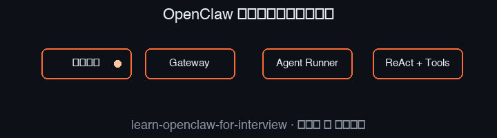

<p align="center">
  
</p>

<h1 align="center">🦞 从零精通 OpenClaw —— 面试通关完全指南</h1>

<p align="center">
  <strong>零基础 → 理解原理 → 实战上手 → 写进简历 → 征服面试官</strong>
</p>

<!-- GitHub README 里真正能「动」的，主要是 GIF（以及部分浏览器里 SVG SMIL）。learn-claude-code 的炫酷交互来自它的 web 子项目 + 官网，不是纯 Markdown 魔法。 -->
<p align="center">
  
</p>
<p align="center">
  <sub>上图：本仓库用脚本生成的循环 GIF，在网页打开本仓库时会自动播放。</sub><br/>
  <sub>另附 <a href="assets/hero-flow-animated.svg">hero-flow-animated.svg</a>（SMIL 路径动画，部分环境下可见）。</sub>
</p>

<p align="center">
  <a href="#课程导航">课程导航</a> •
  <a href="#为什么要学-openclaw">为什么学</a> •
  <a href="#学习路线图">路线图</a> •
  <a href="#面试专区">面试专区</a> •
  <a href="#参考资源">资源</a>
</p>

<p align="center">
  
  
  
  
</p>

---

## 为什么不像 learn-claude-code 那样「整页会动」？

[shareAI-lab/learn-claude-code](https://github.com/shareAI-lab/learn-claude-code) 的观感很大程度上来自：

1. 仓库里的 **`web/`** 子项目（Next.js），本地 `npm run dev` 后是**交互式学习页**；
2. 官网 **[learn.shareai.run](https://learn.shareai.run)** 上的可视化与动效。

**GitHub 的 README 本身不支持** 在页面里跑 React、Canvas 动画或任意 JavaScript，所以纯仓库首页要做到「和官网一样炫」，常见做法是：

| 做法 | 说明 |
|------|------|
| **README 里放 GIF / 短视频** | 兼容性最好，一点开仓库就能看到动效（本仓库已加）。 |
| **放一张 SVG** | 可用 SMIL 做简单路径动画；GitHub 会过滤部分标签，效果因浏览器而异。 |
| **GitHub Pages** | 单独部署静态站点，README 里放链接，体验最接近 learn-claude-code 的 web。 |

若你希望做到同级别交互，下一步可以是：用 Vite/Next 做一个极简「课程路线图 + ReAct 流程」单页，挂到 `gh-pages` 分支并在 README 顶部放链接。

---

## 这是什么？

> **OpenClaw** 是 2026 年最火的开源 AI Agent 项目（GitHub 33万+ Star），黄仁勋在 GTC 大会上称之为"AI 界的 Windows"。

本仓库是一份**从零开始、面向面试**的 OpenClaw 完全学习指南。无需任何 AI/编程基础，20 节课带你从"什么是 AI"走到"面试官问什么都能答"。

### 适合谁？

| 你的情况 | 本课程能帮你什么 |
|---------|--------------|
| 完全小白，没接触过 AI | 从 AI 基本概念讲起，手把手带入门 |
| 想转型 AI 方向 | 系统学习 Agent 架构，建立技术体系 |
| 准备面试，想写进简历 | 提供简历模板 + 面试题库 + 项目描述 |
| 会用但不懂原理 | 深入源码级架构分析，知其所以然 |

---

## 为什么要学 OpenClaw？

```
2026年春招，字节/阿里/腾讯/美团等大厂面试高频考点

面试官问：「你了解 OpenClaw 吗？」
❌ "就是个 AI 助手吧..."
✅ "OpenClaw 采用 Fat Gateway 架构，核心是 ReAct 循环..."

面试官问：「它和 ChatGPT 有什么区别？」
❌ "功能更多？"
✅ "ChatGPT 是对话闭环，OpenClaw 是执行闭环。它有自己的控制面和数据面..."
```

---

## 学习路线图

```
                    🦞 OpenClaw 学习路线图
    
    ┌─────────────────────────────────────────────────┐
    │          第一阶段：基础认知（第1-5课）              │
    │  AI基础 → Agent概念 → OpenClaw定位 → 安装 → 初体验 │
    └──────────────────────┬──────────────────────────┘
                           │
                           ▼
    ┌─────────────────────────────────────────────────┐
    │          第二阶段：核心架构（第6-10课）             │
    │  Gateway → Agent Runner → ReAct → Context → Memory│
    └──────────────────────┬──────────────────────────┘
                           │
                           ▼
    ┌─────────────────────────────────────────────────┐
    │          第三阶段：进阶实战（第11-15课）            │
    │  Skills → MCP → 多渠道 → 插件开发 → 自动化工作流   │
    └──────────────────────┬──────────────────────────┘
                           │
                           ▼
    ┌─────────────────────────────────────────────────┐
    │          第四阶段：面试冲刺（第16-20课）            │
    │  安全 → 源码 → 系统设计 → 简历包装 → 模拟面试     │
    └─────────────────────────────────────────────────┘
```

---

## 课程导航

### 第一阶段：基础认知 🌱

> 从零开始，建立对 AI Agent 和 OpenClaw 的整体认知

| 课号 | 标题 | 关键词 | 预计时长 |
|:---:|------|-------|:------:|
| 01 | [什么是 AI、大模型和 Agent？](lessons/01-what-is-ai-agent.md) | AI基础, LLM, Agent概念 | 45min |
| 02 | [Agent 的核心概念：Tool Calling 与 ReAct](lessons/02-agent-core-concepts.md) | Tool Calling, ReAct循环, System Prompt | 60min |
| 03 | [OpenClaw 是什么？为什么它这么火？](lessons/03-what-is-openclaw.md) | 项目定位, 发展历史, 核心能力 | 45min |
| 04 | [动手安装 OpenClaw](lessons/04-install-openclaw.md) | 环境配置, Node.js, 安装部署 | 60min |
| 05 | [第一次对话：Hello OpenClaw！](lessons/05-first-conversation.md) | CLI交互, Dashboard, 基础命令 | 45min |

### 第二阶段：核心架构 🏗️

> 深入理解 OpenClaw 的技术架构，这是面试的重中之重

| 课号 | 标题 | 关键词 | 预计时长 |
|:---:|------|-------|:------:|
| 06 | [整体架构：Fat Gateway 模式](lessons/06-gateway-architecture.md) | Gateway, 控制面/数据面, WebSocket | 60min |
| 07 | [Agent Runner：消息如何被处理](lessons/07-agent-runner.md) | Agent Runner, 消息链路, Lane队列 | 60min |
| 08 | [ReAct 循环：Agent 的大脑回路](lessons/08-react-loop.md) | ReAct循环, 推理-行动, 工具调用链 | 60min |
| 09 | [Context Window：最核心的工程约束](lessons/09-context-window.md) | 上下文窗口, Compaction, 裁剪策略 | 60min |
| 10 | [Memory 系统：让 AI 拥有记忆](lessons/10-memory-system.md) | SOUL.md, MEMORY.md, 向量搜索 | 60min |

### 第三阶段：进阶实战 🔧

> 掌握进阶功能，积累实战经验

| 课号 | 标题 | 关键词 | 预计时长 |
|:---:|------|-------|:------:|
| 11 | [Skills 系统与 ClawHub 生态](lessons/11-skills-system.md) | Skills, ClawHub, SKILL.md | 60min |
| 12 | [MCP 协议：Agent 的通用语言](lessons/12-mcp-protocol.md) | MCP协议, 工具标准化, Server/Client | 60min |
| 13 | [多渠道接入：从 Telegram 到飞书](lessons/13-multi-channel.md) | Channel Plugin, 消息路由, 会话隔离 | 60min |
| 14 | [插件开发：写你的第一个 Plugin](lessons/14-plugin-development.md) | Plugin架构, 能力注册, Hook系统 | 90min |
| 15 | [自动化工作流：HEARTBEAT 与定时任务](lessons/15-automation-workflow.md) | HEARTBEAT.md, 自动化, 工作流编排 | 60min |

### 第四阶段：面试冲刺 🎯

> 面向面试的针对性准备，确保能从容应对面试官的所有问题

| 课号 | 标题 | 关键词 | 预计时长 |
|:---:|------|-------|:------:|
| 16 | [安全与治理：企业级落地的核心挑战](lessons/16-security-governance.md) | 权限控制, 沙箱隔离, 安全审计 | 60min |
| 17 | [源码导读：关键模块逐行分析](lessons/17-source-code-tour.md) | TypeScript, 源码结构, 核心函数 | 90min |
| 18 | [系统设计题：如何设计一个 Agent 系统](lessons/18-system-design.md) | 架构设计, 高可用, 扩展性 | 90min |
| 19 | [简历包装：如何展示 OpenClaw 项目经验](lessons/19-resume-guide.md) | 简历模板, STAR法则, 项目描述 | 60min |
| 20 | [模拟面试：50 道高频面试题全解析](lessons/20-mock-interview.md) | 面试题库, 答题框架, 高分策略 | 120min |

---

## 面试专区

> 面试是本课程的终极目标，这里是精华中的精华

- [面试题库：50 道高频题 + 详细解析](interview/questions.md)
- [简历模板：OpenClaw 项目经验怎么写](interview/resume-template.md)
- [面试话术：如何介绍 OpenClaw 项目](interview/project-introduction.md)
- [面试官视角：他们到底想考什么？](interview/interviewer-perspective.md)

---

## 快速开始

```bash
# 1. 克隆本仓库
git clone https://github.com/bcefghj/learn-openclaw-for-interview.git

# 2. 按照课程顺序学习
# 从 lessons/01-what-is-ai-agent.md 开始

# 3. 每节课后完成练习题
# 练习题在每课末尾的「动手练习」部分

# 4. 面试前重点复习面试专区
# interview/ 目录下的内容
```

---

## 参考资源

### 官方资源
- [OpenClaw GitHub](https://github.com/openclaw/openclaw) - 官方仓库（33万+ Star）
- [OpenClaw 官方文档](https://docs.openclaw.ai) - 官方文档
- [ClawHub](https://clawhub.com) - 官方技能市场

### 学习资源
- [awesome-openclaw-tutorial](https://github.com/xianyu110/awesome-openclaw-tutorial) - 最全中文教程（3400+ Star）
- [openclaw-tutorial by Datawhale](https://github.com/datawhalechina/openclaw-tutorial) - 一周速成教程
- [hand-on-openclaw](https://github.com/datawhalechina/hand-on-openclaw) - 实战手册
- [openclaw-course-from-scratch](https://github.com/cloudzun/openclaw-course-from-scratch) - 从零开始课程

### 面试资源
- [面试鸭 OpenClaw 题库](https://www.mianshiya.com/bank/2031640554575519745) - 26 道企业真题
- [OpenClaw 底层架构拆解](https://cloud.tencent.com/developer/article/2632386) - 腾讯云技术文章
- [面试官视角：OpenClaw 到底考什么](https://www.gankinterview.cn/zh-CN/blog/what-is-the-interviewer-really-testing-when-asking-about-openclaw) - 面试策略

### 技术深度
- [OpenClaw 架构深度剖析](https://enricopiovano.com/blog/openclaw-architecture-deep-dive) - 六层架构分析
- [Agent Runner 函数级剖析](https://openclaw-docs.dx3n.cn/beginner-openclaw-guide/25-函数级剖析-agent-runner-execution) - 源码级分析
- [OpenClaw 源码解析：Gateway 启动](https://www.ququ123.top/2026/03/openclaw-gateway-startup/) - Gateway 源码

---

## 学习建议

1. **不要跳课**：每节课的内容是层层递进的，跳过前面的基础会导致后面听不懂
2. **动手实践**：每节课都有实践环节，一定要亲自动手操作
3. **做笔记**：把关键架构图和概念用自己的话总结一遍
4. **刷面试题**：学完每个阶段后，及时做对应的面试题
5. **模拟面试**：找朋友互相模拟面试，或者对着镜子自己讲

---

## 贡献

欢迎提交 Issue 和 PR！如果觉得有帮助，请给个 Star ⭐

## License

MIT License

---

<p align="center">
  <sub>Made with ❤️ for every job seeker in 2026</sub>
</p>
